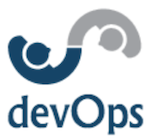

# Welcome to the devOps unit of Codesmith's immersive program.

#### The purpose of this unit is for you to gain an understanding of:

1. What is devOps?
  a) [Reading] Definition.
  b) [Reading] History.
  c) [Reading] Modern application.
2. What should developers learn to work well in devOps-oriented companies?
  a) [Reading] Importance of communication between teams.
  b) [Challenge] Deployment. (AWS)
  c) [Challenge] Continuous integration tooling. (Travis CI)
  d) [Reading] Receiving feedback and how feedback affects continuous deployment.
  d) [Challenge] Implementing new features. (Coding)
  e) [Challenge] Testing new features. (Testing library)
  f) [Challenge] Adding new tests in continuous integration tool. (Travis CI)
  g) [Challenge] Re-deployment. (AWS)