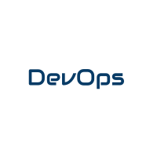
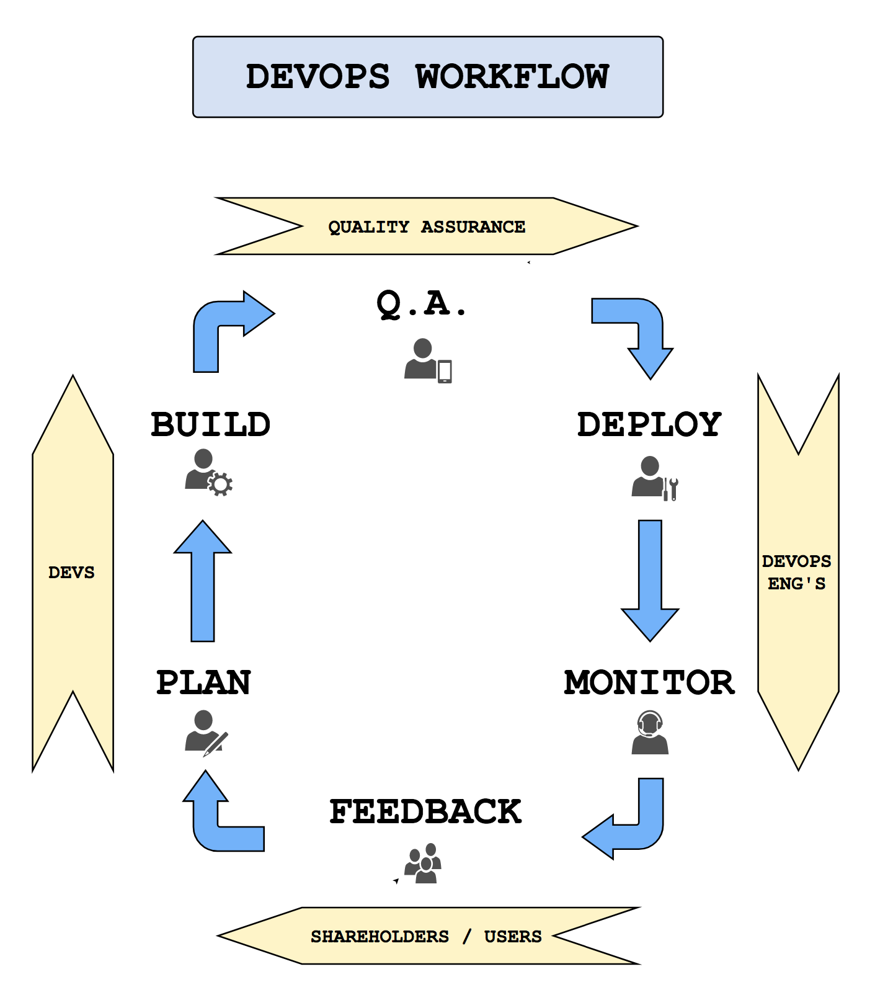

# Welcome to the DevOps unit of Codesmith's immersive program.

### The purpose of this unit is for you to gain an understanding of:

#### 1. What is DevOps?
  - [Reading] Definition.
  - [Reading] History.
  - [Reading] Modern application.
#### 2. What should developers learn to work well in DevOps-oriented companies?
  - [Reading] Importance of communication between teams.
  - [Challenge] TEST Continuous integration tooling. (Travis CI) - QA implied
  - [Challenge] RELASE Deployment. (AWS)
  - [Reading] FEEDBACK Receiving feedback and how feedback affects continuous deployment. Planing implied
  - [Challenge] BUILD Implementing new features. (Coding)
  - [Challenge] TEST Testing new features. (Testing library)
  - [Challenge] TEST Adding new tests in continuous integration tool. (Travis CI)
  - [Challenge] RELEASE Re-deployment. (AWS)

***

### 1. What is DevOps?
#### Definition.
  DevOps is an organization-wide approach to implementing continuous deployment in keeping with [agile principles](http://agilemanifesto.org/). The term comes from both "development" and "operations", as both the developers (software engineers) and IT operations department (DevOps engineers and possibly Site Reliability Engineers) need to work together to deploy and re-deploy their products with optimum resiliency and frequency. This enables the company to achieve a faster time to market, faster time to recover from any failures, and less failures to begin with.

#### History.

#### Modern application.

Proof of Concept (not part of circular flow) - Setting purpose: Outlines cases / bullet points that the flow is geared towards.

1 PLAN - Product team - New features
2 BUILD - Devs - You know
3 TEST - Devs - Unit Testing / Functional Testing (CI)
4 Q.A. - Q.A. Team / Integration Testing / User Acceptance Testing / Load Testing - Could use QA automation to fake client behavior. Typically gets their own non-production environment.
5 RELEASE - DevOps Engs
6 MONITOR - DevOps Engs / Site Reliability Engineers
7 FEEDBACK - Clientele / Shareholders

